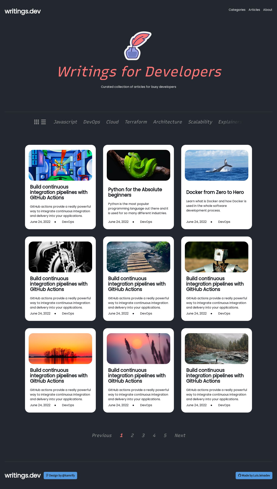

# writings.dev

This is a solution for a static webpage project idea recommended by the full-stack roadmap in [roadmap.sh](https://roadmap.sh), applying HTML and CSS knowledge.

## Tools used

- HTML
- CSS
- Flexbox
- Bootstrap
- Font Awesome

## Screenshot

### Links

**Design in Figma:** [Click here](https://www.figma.com/file/nh0V05z3NB87ue9v5PcO3R/writings.dev?type=design&node-id=0%3A1&mode=design&t=VKKT95jDvIG2YV4K-1)

**Webpage URL:** https://leivadev.github.io/writings.dev-solution/
